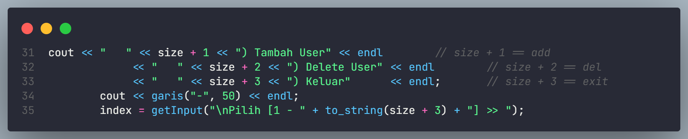

# Tugas Besar Praktikum Algoritma & Struktur Data

## Program Penerimaan Pegawai
### Struktur Direktori Program

 
 

## QnA
### Q:  1. Apakah programnya tidak menerapkan operasi aritmatika?
A: Ada, diterapkan di program user manager, dibagian saat menambahkan atau menghapus user, secara otomatis penomoran menu bertambah.

Dikarenakan diperlukan adanya operasi aritmatika, kami menggunakan aritmatika sederhana untuk menambahkan penomoran menu.
 
 

### Q: 2. apakah pakai library tambahan?
A: Ya, kami menggunakan library tambahan selain library standar, yaitu library : 
- vector : sebagai pengganti array tradisional.
- deque : double-ended queue dalam C++ menyediakan struktur data yang mendukung operasi penambahan dan penghapusan elemen di kedua ujungnya. Deque memungkinkan penambahan dan penghapusan elemen di awal (front) dan akhir (back) deque dengan efisiensi tinggi.

 
 

### Q: 3. Apakah program stack dan queuenya sama?
A: Tidak, temanya sama sama penerimaan pegawai, tapi untuk programnya berbeda, program <b>stack</b> berjalan dari sudut pandang pelamar pekerjaan, dan program <b>queue</b> berjalan dari sudut pandang HRD atau penerima pegawai. 